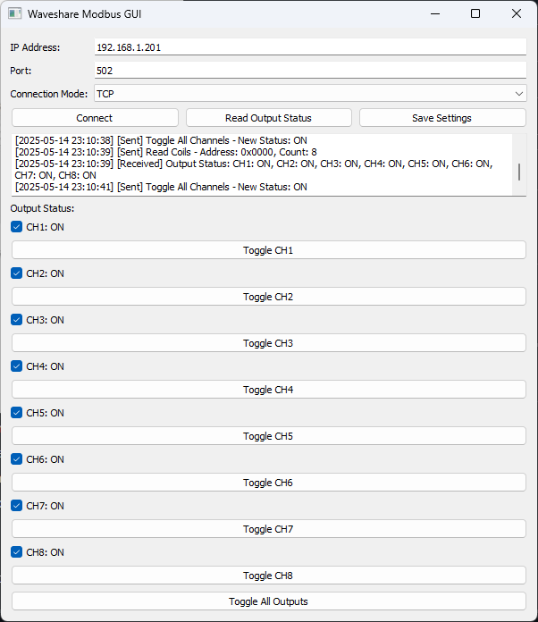

# Waveshare Modbus POE/ETH Relay GUI

A PyQt5-based GUI application for interacting with Waveshare Modbus RTU/TCP/UDP relay modules.  
This tool allows you to connect to a Modbus device, read output (coil) status, toggle individual outputs, and control all outputs at once.

---

## Features

- ✅ Supports **TCP**, **UDP**, and **RTU** Modbus connections  
- ✅ Visual display of 8-channel output statuses  
- ✅ Rename output channels via text boxes  
- ✅ Toggle individual outputs  
- ✅ Toggle all outputs ON or OFF  
- ✅ Save/load connection settings  
- ✅ Log activity and Modbus communication events

---

## Screenshot

  

---

## Requirements

- Python 3.8+
- PyQt5
- pymodbus

Install dependencies:

```bash
pip install -r requirements.txt
